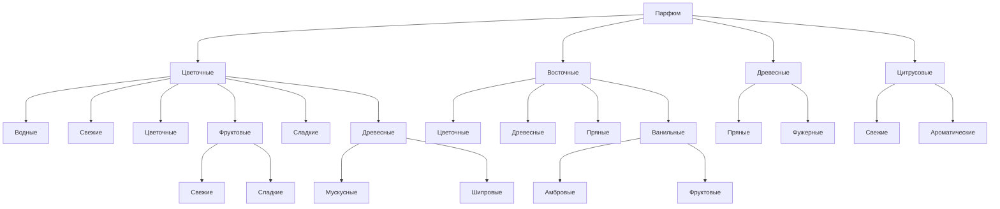

```mermaid
flowchart TD
Парфюм ---> Fl[Цветочные]
Парфюм ---> W[Восточные]
Парфюм ---> T[Древесные]
Парфюм ---> G[Цитрусовые]

Fl ---> Водные
Fl ---> Свежие
Fl ---> Цветочные
Fl ---> Fr[Фруктовые]
Fl ---> Сладкие
Fl ---> Fl_T[Древесные]

Fr ---> Fr_fresh[Свежие]
Fr ---> Fr_sweet[Сладкие]

Fl_T ---> Мускусные
Fl_T ---> Шипровые

W ---> W_fl[Цветочные]
W ---> W_T[Древесные] 
W ---> Пряные
W ---> V[Ванильные]

V ---> Амбровые
V ---> Фруктовые

T ---> T_spice[Пряные]
T ---> Фужерные

G ---> G_fresh[Свежие]
G ---> Ароматические

```