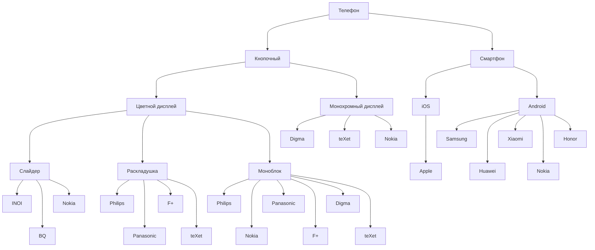

```mermaid
flowchart TD
Телефон ---> Кнопочный
Телефон ---> Смартфон

Кнопочный ---> ЦД[Цветной дисплей]
Кнопочный ---> МД[Монохромный дисплей]

МД --> monoh_digma[Digma]
МД --> monoh_teXet[teXet]
МД --> monoh_nokia[Nokia]

ЦД ---> Слайдер
ЦД ---> Раскладушка
ЦД ---> Моноблок

Слайдер --> slider_inoi[INOI]
Слайдер ---> slider_bq[BQ]
Слайдер --> slider_nokia[Nokia]

Раскладушка --> clam_philips[Philips]
Раскладушка ---> clam_panasonic[Panasonic]
Раскладушка --> clam_f_plus[F+]
Раскладушка ---> clam_texet[teXet]

Моноблок --> monon_philips[Philips]
Моноблок ---> mono_nokia[Nokia]
Моноблок --> mono_panasonic[Panasonic]
Моноблок ---> mono_f_plus[F+]
Моноблок --> mono_digma[Digma]
Моноблок ---> mono_texet[teXet]

Смартфон ---> iOS
Смартфон ---> Android

iOS ---> Apple

Android --> Samsung
Android ---> Huawei
Android --> Xiaomi
Android ---> Nokia
Android --> Honor
```