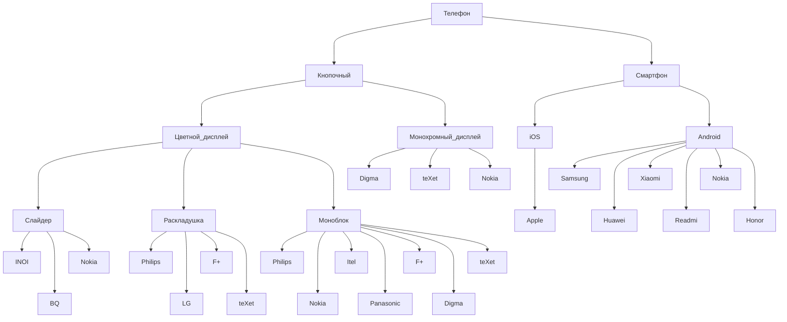

```mermaid
flowchart TD
Телефон ---> Кнопочный
Телефон ---> Смартфон

Кнопочный ---> Цветной_дисплей
Кнопочный ---> Монохромный_дисплей

Монохромный_дисплей --> monoh_digma[Digma]
Монохромный_дисплей --> monoh_teXet[teXet]
Монохромный_дисплей --> monoh_nokia[Nokia]

Цветной_дисплей ---> Слайдер
Цветной_дисплей ---> Раскладушка
Цветной_дисплей ---> Моноблок

Слайдер --> slider_inoi[INOI]
Слайдер ---> slider_bq[BQ]
Слайдер --> slider_nokia[Nokia]

Раскладушка --> clam_philips[Philips]
Раскладушка ---> clam_lg[LG]
Раскладушка --> clam_f_plus[F+]
Раскладушка ---> clam_texet[teXet]

Моноблок --> monon_philips[Philips]
Моноблок ---> mono_nokia[Nokia]
Моноблок --> mono_itel[Itel]
Моноблок ---> mono_panasonic[Panasonic]
Моноблок --> mono_f_plus[F+]
Моноблок ---> mono_digma[Digma]
Моноблок --> mono_texet[teXet]

Смартфон ---> iOS
Смартфон ---> Android

iOS ---> Apple

Android --> Samsung
Android ---> Huawei
Android --> Xiaomi
Android ---> Readmi
Android --> Nokia
Android ---> Honor
```